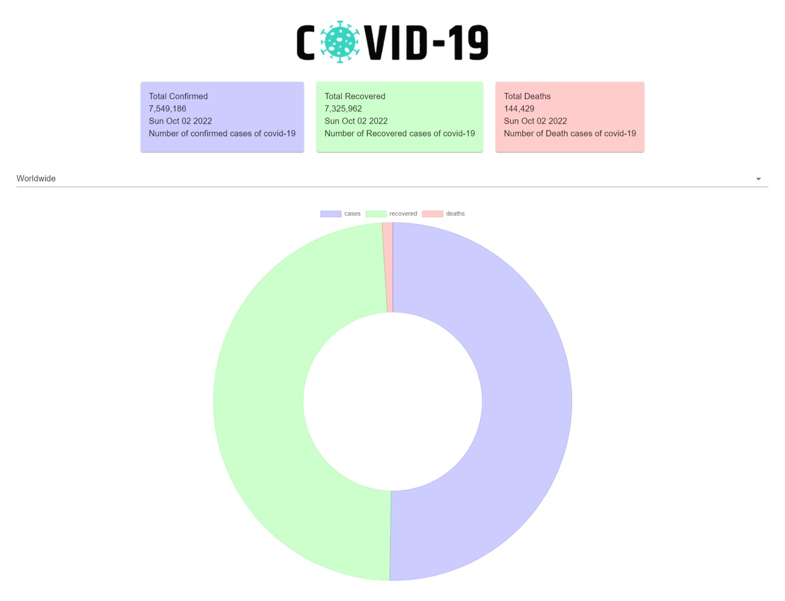

# Covid 19 Tracker React App created using Reactjs

## Getting Started

1- clone Project and install dependencies using npm install

2- npm start and enjoy

## Libraries used in this Project

Reactjs

axios

Chart.js

Material ui v5

## ScreenShot of Project

